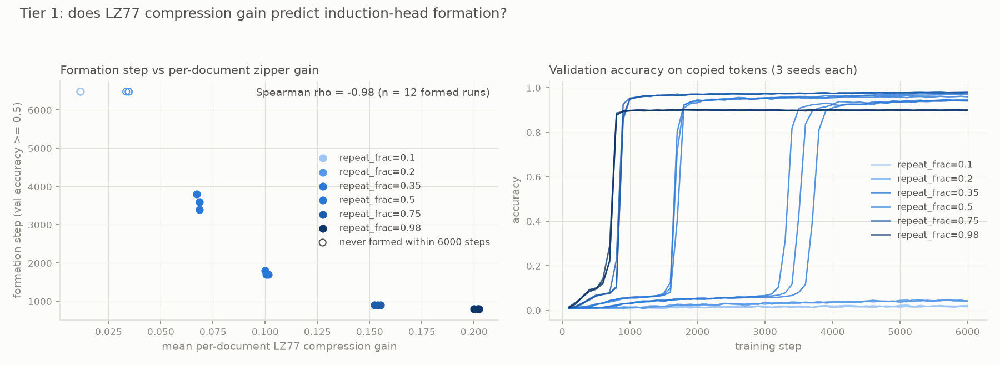
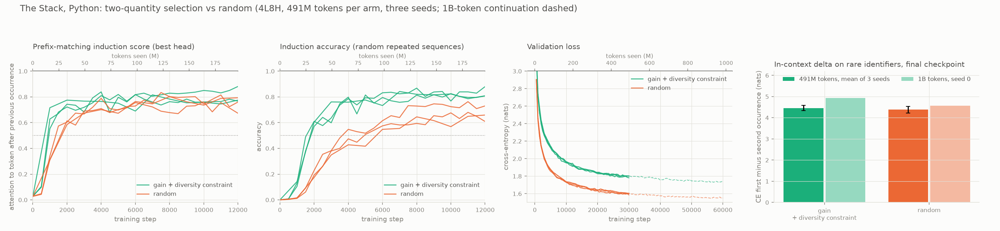

# Can we pick training data so that a circuit forms earlier?

A language model learns its abilities as small internal **circuits**: groups
of attention heads and neurons that together perform one computation. This
project asks three questions about one such circuit:

1. How does it form during training, and which properties of the training
   data make it form sooner or later?
2. Can we score each document, before training, by how much it would help
   that circuit form?
3. If we then **choose** training data by that score, does the circuit form
   earlier, or with less data, than on a random sample of the same corpus,
   and what does that cost?

The answers, in short: yes, a free score computed with `gzip` predicts when
the circuit forms; selecting a third of a pool by it forms the circuit seven
times sooner on synthetic data and two to three times sooner on 2.5B tokens
of real Python; and the price is a narrower training distribution, which a
second score from the same compressor measures and limits.

- **Two-page summary:** [docs/summary_2page.pdf](docs/summary_2page.pdf)
- **Paper draft:** [docs/main_v04.pdf](docs/main_v04.pdf) (source `docs/main.tex`)
- **Lab notebook:** [docs/findings.md](docs/findings.md), every experiment with its numbers, dated, including the ones that failed
- **Original brief:** [docs/brief.md](docs/brief.md)

## Why this matters

Today's data-selection methods (filtering by loss, matching a target
distribution, removing duplicates) score each document with one number that
mixes every ability together. They cannot say which ability a decision helps
or hurts, because they never look at what the model builds inside. A score
aimed at one specific circuit can.

## The circuit we chose, and the trick

We chose the **induction head**, the best-understood circuit in transformers
and the one behind in-context learning. When the model sees a token it has
seen before in the current context, the head looks back to that earlier
occurrence and predicts whatever followed it last time. Given
"Mr Dursley ... Mr", it predicts "Dursley".

This is exactly what the `gzip` compressor does: its LZ77 algorithm finds the
earlier occurrence of the current string and replaces the repeat with a
pointer. So `gzip` can stand in for the circuit. Our score for a document is
its **compression gain**: how much shorter it compresses than a shuffled copy
of itself. The shuffle keeps the word counts, so only genuine repeated
structure counts. It needs no model and costs nothing.

## How we tested it

1. **Built synthetic tasks with adjustable knobs.** Random token sequences
   with an embedded repeat, where we control how much is repeated, how long
   the copies are, how noisy the data is and how big the vocabulary is. Each
   setting is a training set with a different compression gain.
2. **Trained small transformers and recorded when the circuit forms.**
   Checkpoints every 100 steps; at each one we measured whether the induction
   head exists (a head attending to the right earlier token, and patching its
   output into a corrupted run restoring the answer) and whether the model
   copies correctly. The formation step is where these cross a threshold.
   Three seeds per setting, about 200 runs.
3. **Checked the prediction.** Does a dataset's gain tell us, before
   training, when the circuit will form?
4. **Used it to select data.** From a mixed pool, kept a fixed-size subset by
   gain and compared it with a random subset of the same size and with an
   oracle that sees the hidden generating parameters.
5. **Repeated the selection on real data.** 2.5 billion tokens of Python
   from The Stack, on a rented GPU.

## What we found

| Finding | Evidence |
|---|---|
| **The score predicts when the circuit forms.** Higher gain, earlier formation, almost perfectly in rank. The circuit arrives as a sudden jump whose timing follows the score, not the amount of repetition we dialled in. | Spearman −0.98 (attention-only), −0.92 (with MLPs), −1.0 on condition means; three seeds; replicated at 3 layers, 8 heads |
| **Selecting by the score forms the circuit much earlier with a third of the data.** It even beat an oracle that knows how much repetition was *requested* per document, because the compressor measures how much was *produced*. | 20,000 of 60,000 documents: step 700 in every seed vs 5,200 or never for random; oracle 800–1,000; 97% overlap with a copy-length oracle |
| **The data decides which version of the circuit forms.** Depending on copy length the model builds an induction head that looks *k* tokens behind the ideal position, which caps its accuracy. Curves that looked like partial learning were finished circuits of the wrong variant. | Lag family 0–23, same lag in every seed, ceilings match; traced to a positional copier built before the induction head |
| **Where the score fails, a small model takes over.** Tiny vocabularies fool the compressor with accidental repeats; a model that already has an induction head restores the prediction. | ρ from −0.72 to −0.93 pooled over 39 runs |
| **Repetition within a document and variety across documents are different things.** Compression *distance* between documents measures variety; it does not predict formation but relates to generalisation to unseen combinations. | 45 runs of a second task: partial +0.46 with held-out-pair accuracy; |ρ| ≤ 0.16 with formation |



## On real code

From 2.5B tokens of Python (9.77M windows of 256 tokens) we selected a fifth
by gain, with a variety constraint that skips near-duplicate boilerplate, and
compared it with a random fifth. Same 4-layer model, same 491M training
tokens, three seeds each; one seed per arm continued to 983M.

| Training data | Head forms (step) | Copies correctly (step) | Final copy accuracy | Validation loss |
|---|---|---|---|---|
| Selected by score | 1,000, every seed | 2,000, every seed | 0.84–0.86 | 1.78–1.80 |
| Random | 1,500–2,000 | 4,000–6,000 | 0.70–0.78 | 1.59–1.61 |



The selected data forms the head 1.5 to 2 times sooner and the copying
behaviour 2 to 3 times sooner, in every seed. The cost is in the last column:
the model trained on selected data is a worse general language model by 0.2
nats, because the most repetitive fifth of a corpus is a narrower slice of it,
and doubling the budget does not close the gap. Once both models have the
circuit they use it equally well on rare variable names. Selection by this
score buys *when* the circuit forms; variety is what limits the price. A
smaller four-arm study showed the trade-off is tunable: gain buys the
circuit, variety buys the distribution.

The compressor also says in advance where the method cannot work: on
children's stories, long repeated passages cover under 0.4% of tokens, and no
induction head formed in any run.

More figures in [figures/](figures/).

## Reproduce one experiment

```bash
uv sync
uv run pytest                                   # offline tests, about 30 s

# one induction dataset, one 2-layer model, the circuit measured at every checkpoint
uv run python -m data.induction --out datasets/ind.npz --repeat-frac 0.75
uv run python -m train.train --dataset datasets/ind.npz --run ind_s0 --steps 3000
uv run python -m analysis.zipper --dataset datasets/ind.npz --update-results
uv run python -m analysis.circuit --run ind_s0

# the repeat-fraction sweep behind the headline correlation (three seeds, three parallel jobs)
uv run python -m train.sweep --generator data.induction --knob repeat_frac --values 0.35 0.5 0.75 0.98 --seeds 0 1 2
uv run python -m analysis.summarize --knob repeat_frac --runs "rep*_s*" --correlate zipper_score:formation_step_acc50

# the selection experiment: pool, arms, training, summary
uv run python -m selection.experiment --n 20000 --seeds 0 1 2
```

Everything synthetic runs on a laptop CPU. The Stack experiment ran on one
rented RTX 4090 for about $7; its pipeline is in `pod/` and its plan in
`docs/runpod_plan.md`.

## What this involved

Everything was built from scratch in Python with PyTorch and TransformerLens:
the task generators, training and checkpointing, the circuit measurements
(attention patterns, exact logit attribution, activation patching, minimal
sufficient head sets), the scores, the selector, and a streaming pipeline for
The Stack. One habit paid off: trace what a trained model actually does
before running a sweep. Three times this caught a model solving the task by a
shortcut that would have given clean results about the wrong circuit, and the
task was redesigned each time.

## Layout

| Path | Purpose |
|---|---|
| `data/` | Two synthetic tasks: the pure induction task (`induction.py`) and the two-name IOI-style task (`generator.py`), each with independently controllable data knobs |
| `train/` | Training with checkpoints every N steps, a results row per run, memmapped pools for real corpora, resumable runs; `sweep.py` runs one knob across seeds |
| `analysis/` | Compression scores (`zipper.py`), per-checkpoint circuit measurements (`circuit.py`), activation patching and sufficient sets, prefix-matching, lag tracing, in-context delta and swap controls, figures |
| `selection/` | Selection by score, the diversity-constrained greedy selector, and the end-to-end selection experiment |
| `pod/` | Tokenising, scoring and training The Stack on a Runpod GPU |
| `tests/` | Offline tests for the generators, trainer, scores, circuit analysis, patching and selection |
| `docs/` | Paper, summary, findings log, brief, literature notes, Runpod plan |
| `figures/` | Final figures |
| `results/stack/` | The Stack runs' trajectories and analyses, the only results tracked |

## What is still open

Models are small (2 to 4 layers), one circuit family is covered, and the
formation steps are early compared with production budgets. Selection has not
been shown working on prose. The natural next step is a circuit where the
compressor should fail and a learned score take over: facts stated in several
paraphrases.

`CLAUDE.md` holds the working conventions used while the project was built
with Claude Code as a pair; it is kept as part of the record.
